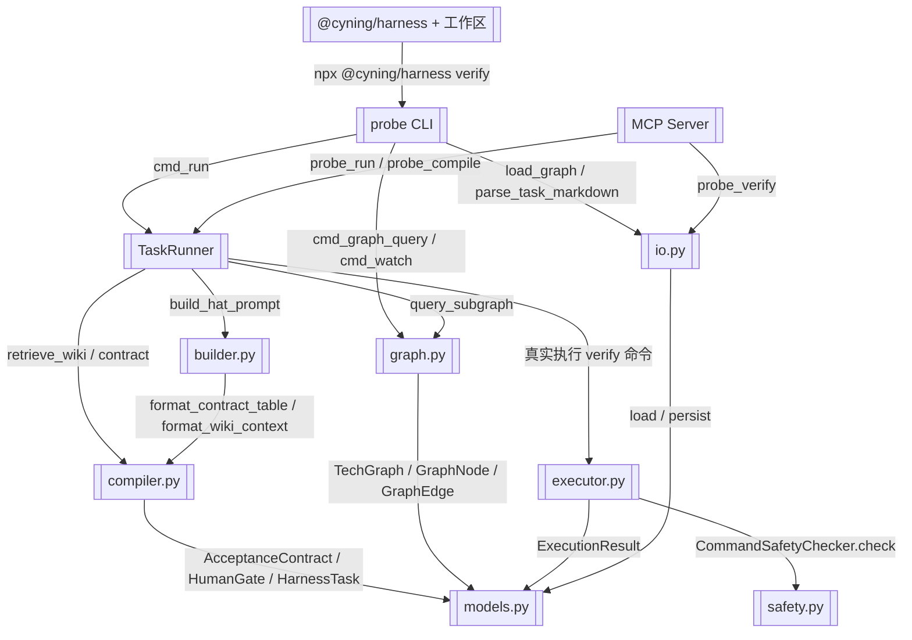

# harness-probe 顶层总图

> 从 CLI 入口到 SDK 各模块、MCP 与外部依赖的全局视图

> **源文件**：`00_main.graph.yaml` · 由 `docs/_tech_graph/scripts/graph_yaml_compile.py` 生成 · 请勿直接手写本文件

## Nodes

| ID | Label | Kind |
|----|-------|------|
| CLI | probe CLI | entry |
| MCP | MCP Server | entry |
| RUNNER | TaskRunner | service |
| BUILDER | builder.py | service |
| COMPILER | compiler.py | service |
| GRAPH | graph.py | service |
| EXECUTOR | executor.py | service |
| SAFETY | safety.py | service |
| MODELS | models.py | data |
| IO | io.py | service |
| EXTERNAL | @cyning/harness + 工作区 | external |

## Edges

| From | To | Label | Type |
|------|----|-------|------|
| CLI | RUNNER | cmd_run |  |
| CLI | GRAPH | cmd_graph_query / cmd_watch |  |
| CLI | IO | load_graph / parse_task_markdown |  |
| MCP | RUNNER | probe_run / probe_compile |  |
| MCP | IO | probe_verify |  |
| RUNNER | BUILDER | build_hat_prompt |  |
| RUNNER | COMPILER | retrieve_wiki / contract |  |
| RUNNER | GRAPH | query_subgraph |  |
| RUNNER | EXECUTOR | 真实执行 verify 命令 |  |
| EXECUTOR | SAFETY | CommandSafetyChecker.check |  |
| BUILDER | COMPILER | format_contract_table / format_wiki_context |  |
| COMPILER | MODELS | AcceptanceContract / HumanGate / HarnessTask |  |
| GRAPH | MODELS | TechGraph / GraphNode / GraphEdge |  |
| EXECUTOR | MODELS | ExecutionResult |  |
| IO | MODELS | load / persist |  |
| EXTERNAL | CLI | npx @cyning/harness verify |  |
