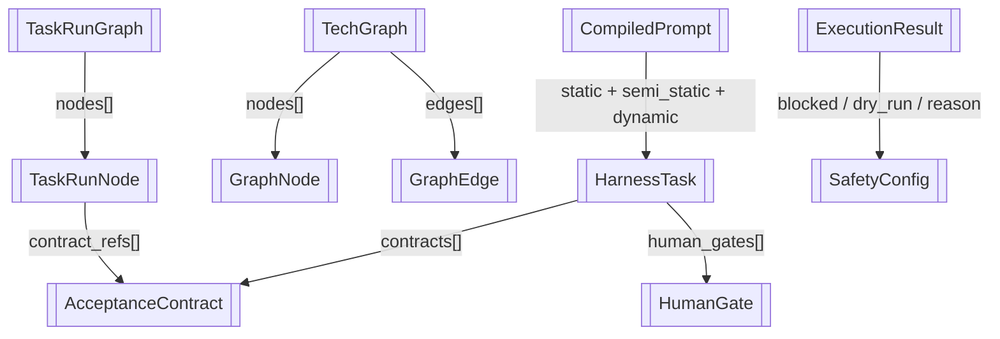

# 核心数据结构

> harness-probe 中 Pydantic 与 dataclass 定义的核心模型

> **源文件**：`01_struct.graph.yaml` · 由 `docs/_tech_graph/scripts/graph_yaml_compile.py` 生成 · 请勿直接手写本文件

## Nodes

| ID | Label | Kind |
|----|-------|------|
| HarnessTask | HarnessTask | data |
| AcceptanceContract | AcceptanceContract | data |
| HumanGate | HumanGate | data |
| TechGraph | TechGraph | data |
| GraphNode | GraphNode | data |
| GraphEdge | GraphEdge | data |
| TaskRunGraph | TaskRunGraph | data |
| TaskRunNode | TaskRunNode | data |
| CompiledPrompt | CompiledPrompt | data |
| ExecutionResult | ExecutionResult | data |
| SafetyConfig | SafetyConfig | data |

## Edges

| From | To | Label | Type |
|------|----|-------|------|
| HarnessTask | AcceptanceContract | contracts[] |  |
| HarnessTask | HumanGate | human_gates[] |  |
| TechGraph | GraphNode | nodes[] |  |
| TechGraph | GraphEdge | edges[] |  |
| TaskRunGraph | TaskRunNode | nodes[] |  |
| TaskRunNode | AcceptanceContract | contract_refs[] |  |
| CompiledPrompt | HarnessTask | static + semi_static + dynamic |  |
| ExecutionResult | SafetyConfig | blocked / dry_run / reason |  |
