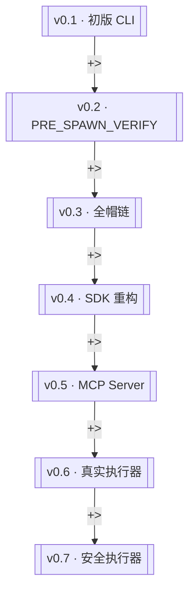

# 版本迭代时间线

> harness-probe v0.1 至 v0.7 的关键能力演进

> **源文件**：`02_version.graph.yaml` · 由 `docs/_tech_graph/scripts/graph_yaml_compile.py` 生成 · 请勿直接手写本文件

## Nodes

| ID | Label | Kind |
|----|-------|------|
| v01 | v0.1 · 初版 CLI | milestone |
| v02 | v0.2 · PRE_SPAWN_VERIFY | milestone |
| v03 | v0.3 · 全帽链 | milestone |
| v04 | v0.4 · SDK 重构 | milestone |
| v05 | v0.5 · MCP Server | milestone |
| v06 | v0.6 · 真实执行器 | milestone |
| v07 | v0.7 · 安全执行器 | milestone |

## Edges

| From | To | Label | Type |
|------|----|-------|------|
| v01 | v02 | +> |  |
| v02 | v03 | +> |  |
| v03 | v04 | +> |  |
| v04 | v05 | +> |  |
| v05 | v06 | +> |  |
| v06 | v07 | +> |  |
