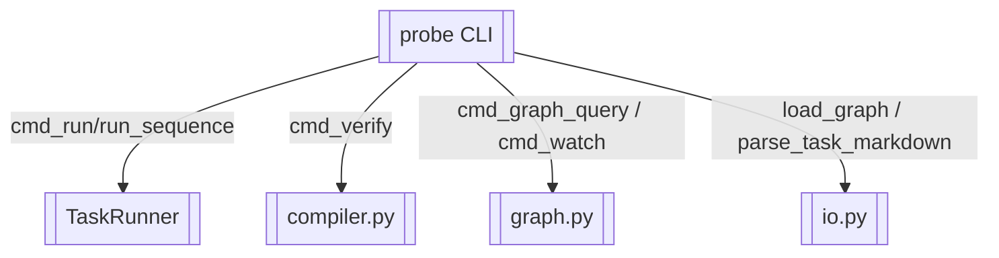

# probe CLI 入口

> argparse 命令分发与参数解析

> **源文件**：`10_cli.graph.yaml` · 由 `docs/_tech_graph/scripts/graph_yaml_compile.py` 生成 · 请勿直接手写本文件

## Nodes

| ID | Label | Kind |
|----|-------|------|
| CLI | probe CLI | entry |
| RUNNER | TaskRunner | service |
| COMPILER | compiler.py | service |
| GRAPH | graph.py | service |
| IO | io.py | service |

## Edges

| From | To | Label | Type |
|------|----|-------|------|
| CLI | RUNNER | cmd_run/run_sequence |  |
| CLI | COMPILER | cmd_verify |  |
| CLI | GRAPH | cmd_graph_query / cmd_watch |  |
| CLI | IO | load_graph / parse_task_markdown |  |
