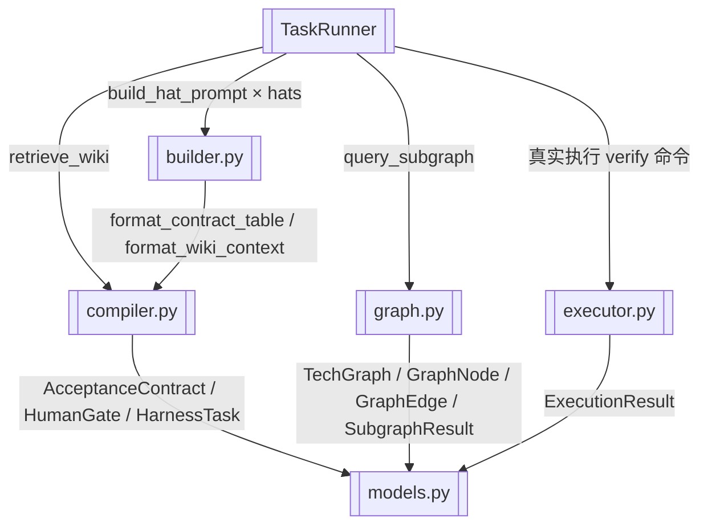

# TaskRunner 多帽执行编排

> 纯逻辑执行器：gate_scan、pre_spawn_verify、run_sequence

> **源文件**：`20_runner.graph.yaml` · 由 `docs/_tech_graph/scripts/graph_yaml_compile.py` 生成 · 请勿直接手写本文件

## Nodes

| ID | Label | Kind |
|----|-------|------|
| RUNNER | TaskRunner | service |
| BUILDER | builder.py | service |
| COMPILER | compiler.py | service |
| GRAPH | graph.py | service |
| EXECUTOR | executor.py | service |
| MODELS | models.py | data |

## Edges

| From | To | Label | Type |
|------|----|-------|------|
| RUNNER | BUILDER | build_hat_prompt × hats |  |
| RUNNER | COMPILER | retrieve_wiki |  |
| RUNNER | GRAPH | query_subgraph |  |
| RUNNER | EXECUTOR | 真实执行 verify 命令 |  |
| BUILDER | COMPILER | format_contract_table / format_wiki_context |  |
| COMPILER | MODELS | AcceptanceContract / HumanGate / HarnessTask |  |
| GRAPH | MODELS | TechGraph / GraphNode / GraphEdge / SubgraphResult |  |
| EXECUTOR | MODELS | ExecutionResult |  |
