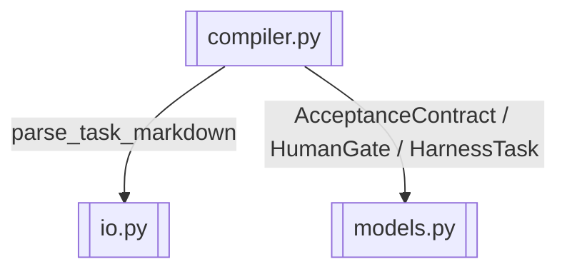

# task parser + contract 编译

> 解析 Markdown task、提取 AcceptanceContract 与 human_gate

> **源文件**：`30_compiler.graph.yaml` · 由 `docs/_tech_graph/scripts/graph_yaml_compile.py` 生成 · 请勿直接手写本文件

## Nodes

| ID | Label | Kind |
|----|-------|------|
| COMPILER | compiler.py | service |
| IO | io.py | service |
| MODELS | models.py | data |

## Edges

| From | To | Label | Type |
|------|----|-------|------|
| COMPILER | IO | parse_task_markdown |  |
| COMPILER | MODELS | AcceptanceContract / HumanGate / HarnessTask |  |
