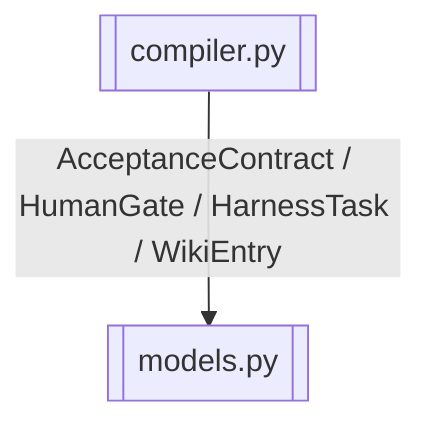

# task parser + contract compiler

> 解析 task.md、编译 AcceptanceContract、校验 human_gate、检索 Wiki

> **源文件**：`30_compiler.graph.yaml` · 由 `docs/_tech_graph/scripts/graph_yaml_compile.py` 生成 · 请勿直接手写本文件

## Nodes

| ID | Label | Kind |
|----|-------|------|
| COMPILER | compiler.py | service |
| MODELS | models.py | data |

## Edges

| From | To | Label | Type |
|------|----|-------|------|
| COMPILER | MODELS | AcceptanceContract / HumanGate / HarnessTask / WikiEntry |  |
