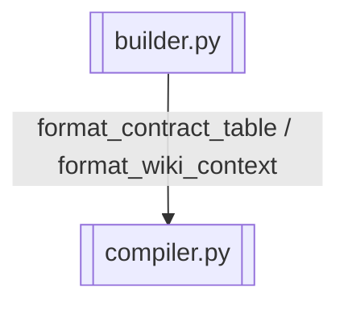

# Prompt 三段式组装

> 按帽子生成 static / semi_static / dynamic 三段式 Prompt

> **源文件**：`40_builder.graph.yaml` · 由 `docs/_tech_graph/scripts/graph_yaml_compile.py` 生成 · 请勿直接手写本文件

## Nodes

| ID | Label | Kind |
|----|-------|------|
| BUILDER | builder.py | service |
| COMPILER | compiler.py | service |

## Edges

| From | To | Label | Type |
|------|----|-------|------|
| BUILDER | COMPILER | format_contract_table / format_wiki_context |  |
