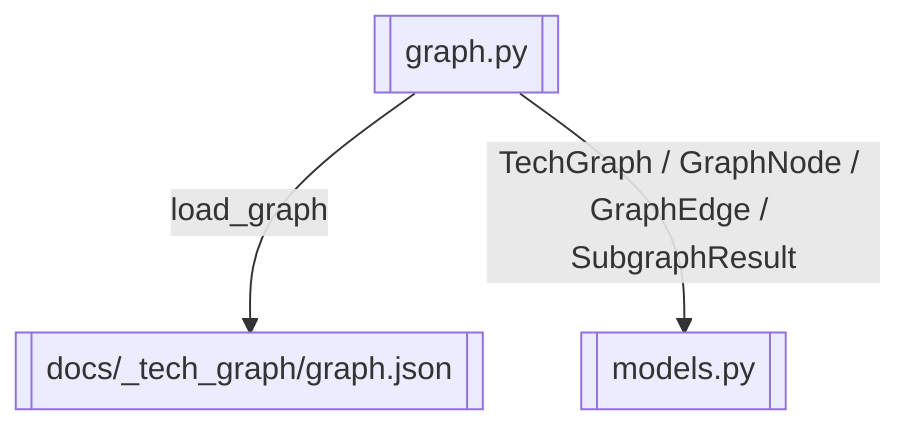

# graph_v2 加载与子图查询

> 加载 graph.json，提供 query_subgraph BFS 与 Mermaid 渲染

> **源文件**：`50_graph.graph.yaml` · 由 `docs/_tech_graph/scripts/graph_yaml_compile.py` 生成 · 请勿直接手写本文件

## Nodes

| ID | Label | Kind |
|----|-------|------|
| GRAPH | graph.py | service |
| MODELS | models.py | data |
| GRAPH_JSON | docs/_tech_graph/graph.json | storage |

## Edges

| From | To | Label | Type |
|------|----|-------|------|
| GRAPH | GRAPH_JSON | load_graph |  |
| GRAPH | MODELS | TechGraph / GraphNode / GraphEdge / SubgraphResult |  |
