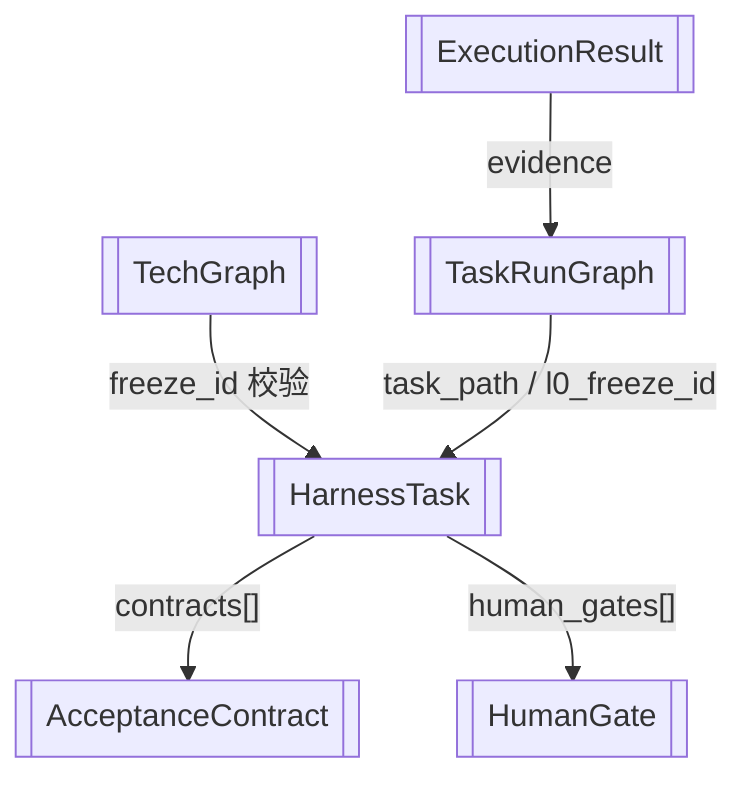

# Pydantic 数据模型

> 核心数据结构定义：task、contract、graph、run、prompt、execution

> **源文件**：`60_models.graph.yaml` · 由 `docs/_tech_graph/scripts/graph_yaml_compile.py` 生成 · 请勿直接手写本文件

## Nodes

| ID | Label | Kind |
|----|-------|------|
| HarnessTask | HarnessTask | data |
| AcceptanceContract | AcceptanceContract | data |
| HumanGate | HumanGate | data |
| TechGraph | TechGraph | data |
| TaskRunGraph | TaskRunGraph | data |
| ExecutionResult | ExecutionResult | data |

## Edges

| From | To | Label | Type |
|------|----|-------|------|
| HarnessTask | AcceptanceContract | contracts[] |  |
| HarnessTask | HumanGate | human_gates[] |  |
| TechGraph | HarnessTask | freeze_id 校验 |  |
| TaskRunGraph | HarnessTask | task_path / l0_freeze_id |  |
| ExecutionResult | TaskRunGraph | evidence |  |
