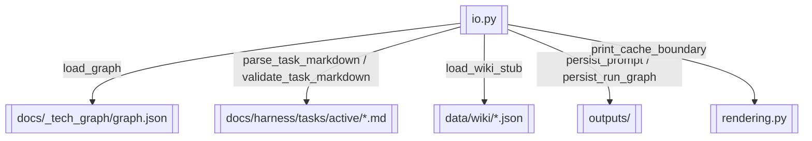

# 文件 IO 与渲染

> graph/task/wiki 加载、Prompt 持久化、task_run JSON 落盘

> **源文件**：`70_io.graph.yaml` · 由 `docs/_tech_graph/scripts/graph_yaml_compile.py` 生成 · 请勿直接手写本文件

## Nodes

| ID | Label | Kind |
|----|-------|------|
| IO | io.py | service |
| RENDERING | rendering.py | service |
| GRAPH_JSON | docs/_tech_graph/graph.json | storage |
| TASK_MD | docs/harness/tasks/active/*.md | storage |
| WIKI_JSON | data/wiki/*.json | storage |
| OUTPUTS | outputs/ | storage |

## Edges

| From | To | Label | Type |
|------|----|-------|------|
| IO | GRAPH_JSON | load_graph |  |
| IO | TASK_MD | parse_task_markdown / validate_task_markdown |  |
| IO | WIKI_JSON | load_wiki_stub |  |
| IO | OUTPUTS | persist_prompt / persist_run_graph |  |
| IO | RENDERING | print_cache_boundary |  |
