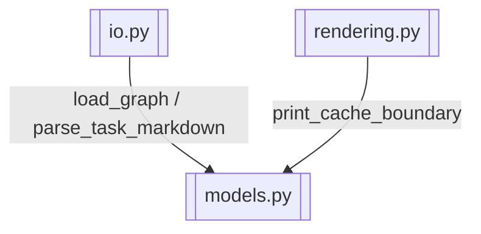

# CLI IO 与渲染

> 文件读写、wiki 加载、Prompt 渲染输出

> **源文件**：`70_io.graph.yaml` · 由 `docs/_tech_graph/scripts/graph_yaml_compile.py` 生成 · 请勿直接手写本文件

## Nodes

| ID | Label | Kind |
|----|-------|------|
| IO | io.py | service |
| RENDERING | rendering.py | service |
| MODELS | models.py | data |

## Edges

| From | To | Label | Type |
|------|----|-------|------|
| IO | MODELS | load_graph / parse_task_markdown |  |
| RENDERING | MODELS | print_cache_boundary |  |
