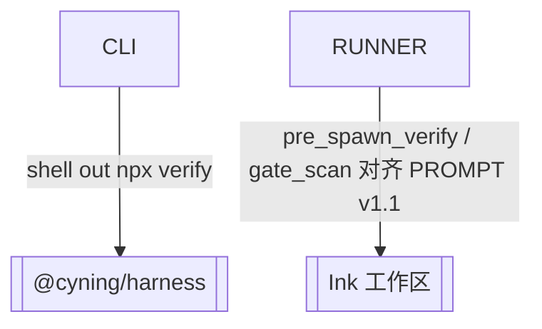

# 外部依赖

> @cyning/harness 产品包与 Ink 工作区规范

> **源文件**：`80_external.graph.yaml` · 由 `docs/_tech_graph/scripts/graph_yaml_compile.py` 生成 · 请勿直接手写本文件

## Nodes

| ID | Label | Kind |
|----|-------|------|
| CYNING_HARNESS | @cyning/harness | external |
| WORKSPACE | Ink 工作区 | external |

## Edges

| From | To | Label | Type |
|------|----|-------|------|
| CLI | CYNING_HARNESS | shell out npx verify | optional_depends_on |
| RUNNER | WORKSPACE | pre_spawn_verify / gate_scan 对齐 PROMPT v1.1 | references |
