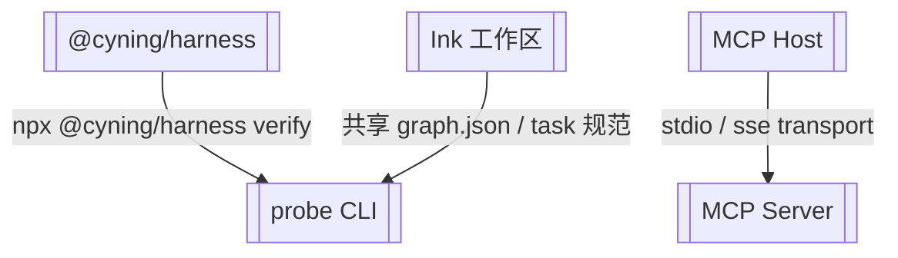

# 外部依赖

> @cyning/harness 产品包、Ink 工作区、MCP Host

> **源文件**：`80_external.graph.yaml` · 由 `docs/_tech_graph/scripts/graph_yaml_compile.py` 生成 · 请勿直接手写本文件

## Nodes

| ID | Label | Kind |
|----|-------|------|
| HARNESS_PKG | @cyning/harness | external |
| INK_WORKSPACE | Ink 工作区 | external |
| MCP_HOST | MCP Host | external |
| CLI | probe CLI | entry |
| MCP | MCP Server | entry |

## Edges

| From | To | Label | Type |
|------|----|-------|------|
| HARNESS_PKG | CLI | npx @cyning/harness verify |  |
| INK_WORKSPACE | CLI | 共享 graph.json / task 规范 |  |
| MCP_HOST | MCP | stdio / sse transport |  |
