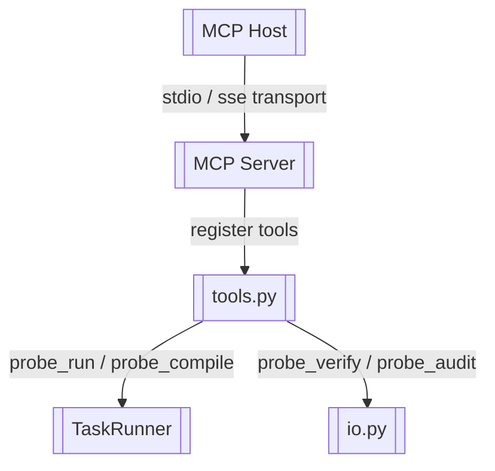

# MCP Server 与 Tools

> 基于 FastMCP 暴露 probe_compile / probe_run / probe_audit / probe_verify

> **源文件**：`85_mcp.graph.yaml` · 由 `docs/_tech_graph/scripts/graph_yaml_compile.py` 生成 · 请勿直接手写本文件

## Nodes

| ID | Label | Kind |
|----|-------|------|
| MCP | MCP Server | entry |
| TOOLS | tools.py | service |
| RUNNER | TaskRunner | service |
| IO | io.py | service |
| MCP_HOST | MCP Host | external |

## Edges

| From | To | Label | Type |
|------|----|-------|------|
| MCP | TOOLS | register tools |  |
| TOOLS | RUNNER | probe_run / probe_compile |  |
| TOOLS | IO | probe_verify / probe_audit |  |
| MCP_HOST | MCP | stdio / sse transport |  |
