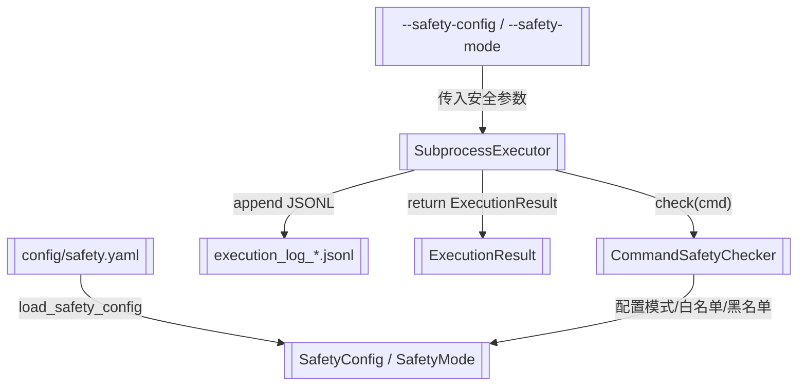

# 真实执行器与安全校验

> SubprocessExecutor + CommandSafetyChecker + 执行日志

> **源文件**：`90_executor.graph.yaml` · 由 `docs/_tech_graph/scripts/graph_yaml_compile.py` 生成 · 请勿直接手写本文件

## Nodes

| ID | Label | Kind |
|----|-------|------|
| EXECUTOR | SubprocessExecutor | service |
| SAFETY | CommandSafetyChecker | service |
| SAFETY_CONFIG | SafetyConfig / SafetyMode | data |
| EXECUTION_LOG | execution_log_*.jsonl | storage |
| MODELS | ExecutionResult | data |
| SAFETY_YAML | config/safety.yaml | storage |
| CLI_ARGS | --safety-config / --safety-mode | input |

## Edges

| From | To | Label | Type |
|------|----|-------|------|
| CLI_ARGS | EXECUTOR | 传入安全参数 |  |
| EXECUTOR | SAFETY | check(cmd) |  |
| SAFETY_YAML | SAFETY_CONFIG | load_safety_config |  |
| SAFETY | SAFETY_CONFIG | 配置模式/白名单/黑名单 |  |
| EXECUTOR | EXECUTION_LOG | append JSONL |  |
| EXECUTOR | MODELS | return ExecutionResult |  |
