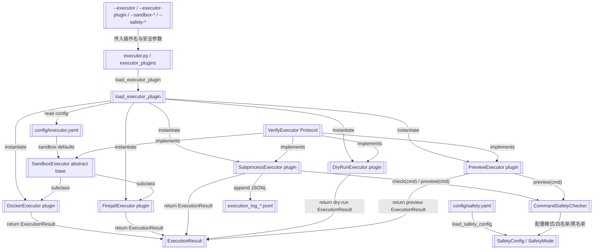

# 执行器插件化 + 沙箱执行器

> VerifyExecutor 协议 + dry-run / preview / subprocess / docker / firejail 插件 + 沙箱配置 + 安全校验

> **源文件**：`90_executor.graph.yaml` · 由 `docs/_tech_graph/scripts/graph_yaml_compile.py` 生成 · 请勿直接手写本文件

## Nodes

| ID | Label | Kind |
|----|-------|------|
| EXECUTOR | executor.py / executor_plugins | service |
| VERIFY_EXECUTOR | VerifyExecutor Protocol | data |
| SUBPROCESS_PLUGIN | SubprocessExecutor plugin | service |
| DRYRUN_PLUGIN | DryRunExecutor plugin | service |
| PREVIEW_PLUGIN | PreviewExecutor plugin | service |
| SANDBOX | SandboxExecutor abstract base | data |
| DOCKER_PLUGIN | DockerExecutor plugin | service |
| FIREJAIL_PLUGIN | FirejailExecutor plugin | service |
| LOADER | load_executor_plugin | service |
| SAFETY | CommandSafetyChecker | service |
| SAFETY_CONFIG | SafetyConfig / SafetyMode | data |
| EXECUTION_LOG | execution_log_*.jsonl | storage |
| MODELS | ExecutionResult | data |
| SAFETY_YAML | config/safety.yaml | storage |
| EXECUTOR_YAML | config/executor.yaml | storage |
| CLI_ARGS | --executor / --executor-plugin / --sandbox-* / --safety-* | input |

## Edges

| From | To | Label | Type |
|------|----|-------|------|
| CLI_ARGS | EXECUTOR | 传入插件名与安全参数 |  |
| EXECUTOR | LOADER | load_executor_plugin |  |
| LOADER | EXECUTOR_YAML | read config |  |
| EXECUTOR_YAML | SANDBOX | sandbox defaults |  |
| LOADER | SUBPROCESS_PLUGIN | instantiate |  |
| LOADER | DRYRUN_PLUGIN | instantiate |  |
| LOADER | PREVIEW_PLUGIN | instantiate |  |
| LOADER | DOCKER_PLUGIN | instantiate |  |
| LOADER | FIREJAIL_PLUGIN | instantiate |  |
| VERIFY_EXECUTOR | SUBPROCESS_PLUGIN | implements |  |
| VERIFY_EXECUTOR | DRYRUN_PLUGIN | implements |  |
| VERIFY_EXECUTOR | PREVIEW_PLUGIN | implements |  |
| VERIFY_EXECUTOR | SANDBOX | implements |  |
| SANDBOX | DOCKER_PLUGIN | subclass |  |
| SANDBOX | FIREJAIL_PLUGIN | subclass |  |
| SUBPROCESS_PLUGIN | SAFETY | check(cmd) / preview(cmd) |  |
| PREVIEW_PLUGIN | SAFETY | preview(cmd) |  |
| DOCKER_PLUGIN | MODELS | return ExecutionResult |  |
| FIREJAIL_PLUGIN | MODELS | return ExecutionResult |  |
| SAFETY_YAML | SAFETY_CONFIG | load_safety_config |  |
| SAFETY | SAFETY_CONFIG | 配置模式/白名单/黑名单 |  |
| SUBPROCESS_PLUGIN | EXECUTION_LOG | append JSONL |  |
| SUBPROCESS_PLUGIN | MODELS | return ExecutionResult |  |
| DRYRUN_PLUGIN | MODELS | return dry-run ExecutionResult |  |
| PREVIEW_PLUGIN | MODELS | return preview ExecutionResult |  |
