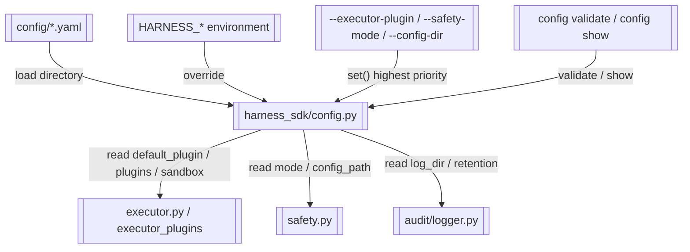

# 配置中心

> 统一配置加载、合并、校验与环境变量/CLI覆盖

> **源文件**：`95_config.graph.yaml` · 由 `docs/_tech_graph/scripts/graph_yaml_compile.py` 生成 · 请勿直接手写本文件

## Nodes

| ID | Label | Kind |
|----|-------|------|
| CONFIG_MANAGER | harness_sdk/config.py | service |
| CONFIG_FILES | config/*.yaml | storage |
| ENV_VARS | HARNESS_* environment | input |
| CLI_OVERRIDES | --executor-plugin / --safety-mode / --config-dir | input |
| CLI_CONFIG | config validate / config show | entry |
| EXECUTOR | executor.py / executor_plugins | service |
| SAFETY | safety.py | service |
| AUDIT | audit/logger.py | service |

## Edges

| From | To | Label | Type |
|------|----|-------|------|
| CONFIG_FILES | CONFIG_MANAGER | load directory |  |
| ENV_VARS | CONFIG_MANAGER | override |  |
| CLI_OVERRIDES | CONFIG_MANAGER | set() highest priority |  |
| CONFIG_MANAGER | EXECUTOR | read default_plugin / plugins / sandbox |  |
| CONFIG_MANAGER | SAFETY | read mode / config_path |  |
| CONFIG_MANAGER | AUDIT | read log_dir / retention |  |
| CLI_CONFIG | CONFIG_MANAGER | validate / show |  |
